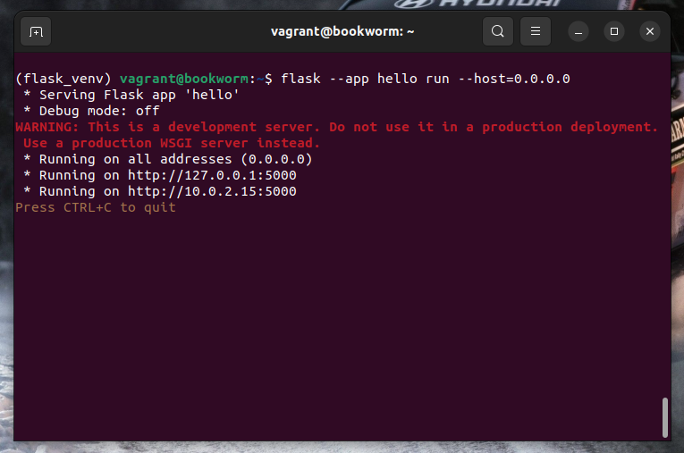
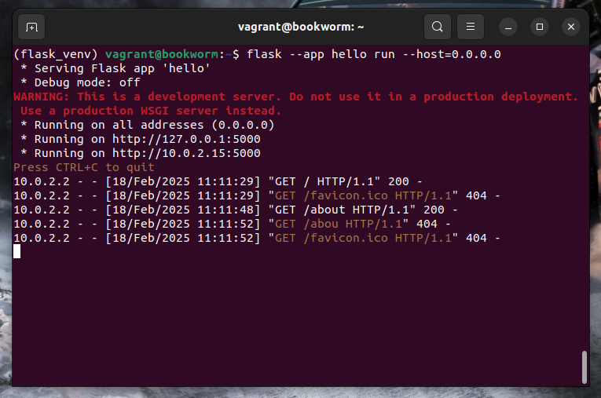
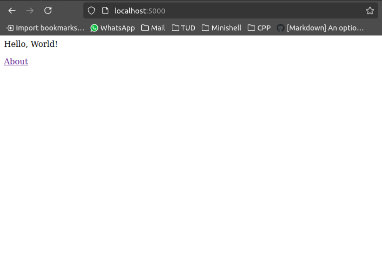

# Lab 3 - Vagrant

The aim of this lab is to wite a Vagrantfile that will automatically set up a VM that will serve a web app. You will see that this DevOps-centric approach to provisioning and deploying a VM is significantly easier than doing it manually, as you would have done previously.

## Setting up Vagrant
For this lab, we will be making use of [Debian](https://www.debian.org/), the Linux distribution that Ubuntu is derived from. We'll sidestep the complexity of the install process by getting Vagrant to install it for us. First, make sure you have [VirtualBox](https://www.virtualbox.org/wiki/Downloads) and [Vagrant](https://developer.hashicorp.com/vagrant/install) intalled on you machine, and then you should be abe to get a working Debian Linux VM running on VirtualBox within a couple of minutes by running:
~~~ bash
mkdir debian_vm
cd debian_vm
vagrant init debian/bookworm64
vagrant up
~~~
> [!NOTE]
> Always create a new folder for each VM.

When the VM is running, you should be able to log into it via SSH by running:
~~~ bash
vagrant ssh
~~~

You should then see a Bash prompt from Debian.

## Running a web app using Flask

For this lab, we will write a web app using [Flask](https://flask.palletsprojects.com/en/stable/), which is a web development framework for Python. We'll start off by running the very simple example described in the [Flask documentation](https://flask.palletsprojects.com/en/stable/quickstart/#a-minimal-application). Before we can do this, we need to install some packages from the Debian repositories, using the **apt** command. The commands to install the packages we need is:
~~~ bash
sudo apt update
sudo apt install git nano vim python-is-python3 python3-venv python3-pip
~~~

> [!NOTE]
> This is installing git, the nano and vim editors, the Python interpreter, the python virtual environment package and pip (the package manager for Python).

> [!NOTE]
> When you run this, it asks you to confirm the changes before actually carrying out the installation. This would be a problem if you were to put this command in a script, because you would ideally like to have the script run automatically without human intervention. Search for a flag to avoid the confirmation in the [apt documentation](https://manpages.debian.org/bookworm/apt/apt.8.en.html). 

Next, we create a virtual environment that we can install Flask into:

~~~ bash
python -m venv flask_venv
~~~

And start it up (activate it):

~~~ bash
source flask_venv/bin/activate
~~~

Now, we can install Flask using pip:

~~~ bash
pip install Flask
~~~

Create a file called *hello.py* in thw VM's home directory, and put the following code into it:

~~~ python
from flask import Flask

app = Flask(__name__)

@app.route('/')
def hello():
    return '
Hello, World!
'
~~~

> [!NOTE]
> This says that when the server receives a HTTP request for the / path, it should send a response containing the HTML code \
Hello, World!\
.

Assuming Flask installed successfully, we can run the app by:

~~~ bash
flask --app hello run --host=0.0.0.0
~~~

 Flask running on the VM

 Flask receiving requests on the VM

You should be able to open another terminal/command prompt window, run ``vagrant ssh`` again to log into the VM again, and run ``curl -O http://localhost:5000`` to download the HTML file and prove that the app works. The aoutput should be stored in a file called *curl_response*.

## Automating this deployment

At this point we have a working app, but we would like to do two further things:
- Automate the deployment on a VM
- Use port forwarding to let us access the web app from your host machine

In order to do this, you should develop a Vagrantfile to automate the deployment of the app using the steps documented before.

Stop the Flask app by pressing *Ctrl+C*, then run the command ``exit`` to log out of the VM. Shut down and delete the VM with the following commands:

~~~ bash
vagrant halt
vagrant destroy
~~~

The Vagrantfile should:
- Run the commands above from the apt installation commands until the pip command. Use the **shell** provisioner to do this, keep in mind it should be fully automatic.
- Upload the *hello.py* file to the VM using the **file** provisioner.
- Add port forwarding to the Vagrantfile. The Flask server listens on port 5000 of the guest. This is done using the **config.vm.network** command in the Vagrantfile.
- The provisioning process should run automatically next time you run **vagrant up**.

When this works, you should be able to access the wep app on your host machine. Assuming you forwarded to port 5000, you coul run **http://localhost:5000** in your browser and see the message from the app.

## Modifying the app
Make a change to the app so that it serves two pages: one for the / route and another for a new **/about** route.
For **/about**, it should display a message saying "This is a Flask web app running in a Linux VM".
Modify the / route to include a link to this page.

 Brower viewing the web page
