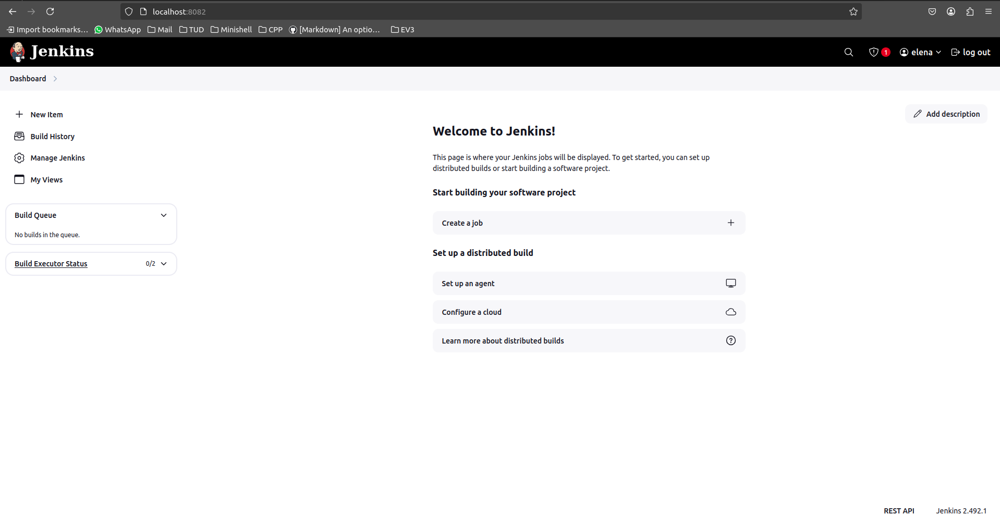
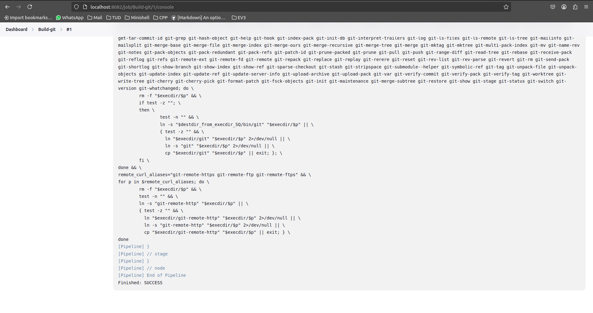
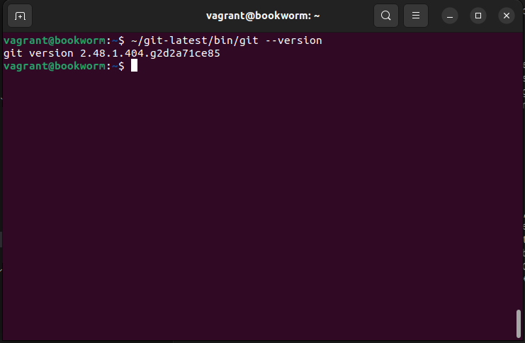
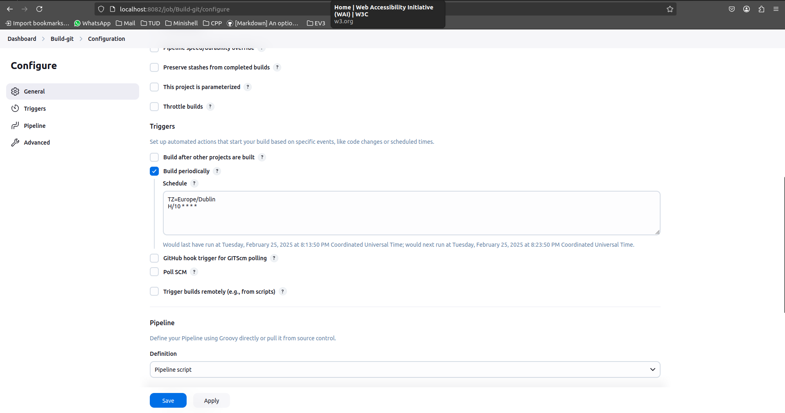
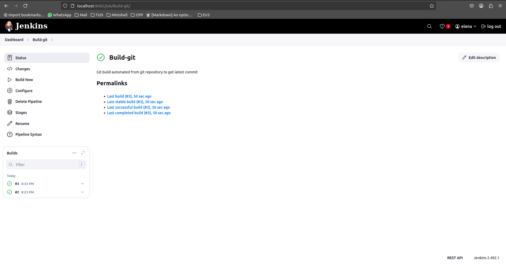

# Lab 4 - Continuous integration with Jenkins

For this lab, we'll set up a Jenkins install, and use it to build the latest version of git once every ten minutes. This will give a good first approximation of how a CI pipeline works.

## Installing Jenkins
I will be using a Debian-based Vagrantfile to install Jenkins on a VM.

After the VM boots for the first time, you have to give Jenkins root access to your machine by running: ``sudo EDITOR=vim visudo -f /etc/sudoers``. Add the following line to the file that opens: ``jenkins    ALL = NOPASSWD: ALL``
>[!NOTE]
> There is a tab character betwwen ``jenkins`` and ``ALL``, the rest are spaces.

Also, run `systemctl status jenkins` to verify that the above worked and that Jenkins is running.

## Setting up Jenkins
After installation you have to create a user account. This can be done via the web interface. For the VM, start up a browser on your host machine, and go to the URL `localhost:8082`. You should get a screen that says Unlock Jenkins.

To log in for the first time, run the following command on the VM:
~~~bash
sudo cat /var/lib/jenkins/secrets/initialAdminPassword
~~~
Enter the password into the webpage and click *Continue*. On the next page, click *Install suggested plugins*. This will take a few minutes to run. When finished, you'll be brought to a page to create a permanent administrator account, with a username, password etc of your choosing. After this, you'll come to the Jenkins main page (*Dashboard*).

<figure>
  
  <figcaption>Jenkins Dashboard</figcaption>
</figure>

Now, we can create our Pipeline to build git. Click *New Item* on the left-hand side of the page, and then select *Pipeline* in the menu that appears. You'll also need to give the Pipeline a name ("Build git").

Click *OK*, and you'll be brought to a big list of options. We don't have to fill out everything on this page, but there are some things you should do:
- Type a human-readable description of the pipeline in the description field.
- Check *Discard old builds* and set the *Max # of builds to keep* to 2.
- At the bottom of the page, ensure the *Description* field is set to *Pipeline script*.
- In the box below that, use the following *Jenkinsfile* script:

~~~Groovy
pipeline {
    agent any

    stages {
        stage('Clone the git repo') {
            steps {
                git 'https://github.com/git/git'
            }
        }

        stage('Prepare the build') {
            steps {
                sh 'make configure'
                sh './configure --prefix=/home/vagrant/git-latest'
            }
        }
        // the prefix is the path to the installation folder

        stage('Perform the build') {
            steps {
                sh 'make'
            }
        }

        stage('Install the finished programme') {
            steps {
                sh 'sudo make install'
            }
        }
    }
}
~~~

Now, click *Save*. You should be brought to the Pipeline screen.

On the menu on the left, you see the option *Build Now*. Click that to start the Pipeline. The build process should appear below this menu. Click on it and then click *Console Output* to watch the build process run.

<figure>
  
  <figcaption>Console Log showing successful Build</figcaption>
</figure>

The build process is quite slow (git is a large piece of software, so building it could take 30 minutes or so, depending on your computer). Regardless of how long it takes, it should all be automated. After it has finished, you should be able to type:
~~~bash
~/git-latest/bin/git --version
~~~

<figure>
  
  <figcaption>Periodic Build Configuration</figcaption>
</figure>

on the guest to see the newly built programme. Now, we want to change things so that it runs once every ten minutes. To do this, go back to the main page for the pipeline and click *Configure*. You'll be brought back to the page we initially used to setup the pipeline. Check the box *Build periodically*, and in the *Schedule* box that appears, fill in the followings:
~~~
TZ=Europe/Dublin
H/10 * * * *
~~~

<figure>
  
  <figcaption>Periodic Build Configuration</figcaption>
</figure>

This uses a [cron-like syntax](https://en.wikipedia.org/wiki/Cron) to tell Jenkins to re-run the task every 10 minutes later. Jenkins will automatically pull from the git repository in the future, rather than clone it again. It will then re-run make. Thanks to incremental builds, make will do nothing if no changes have been made since the last run, so most future runs will be very fast, and won't change the executable. Again, click *Save* to save your changes and verify that a new build is attempted 10 minutes later.

<figure>
  
  <figcaption>Periodic Build Configuration</figcaption>
</figure>