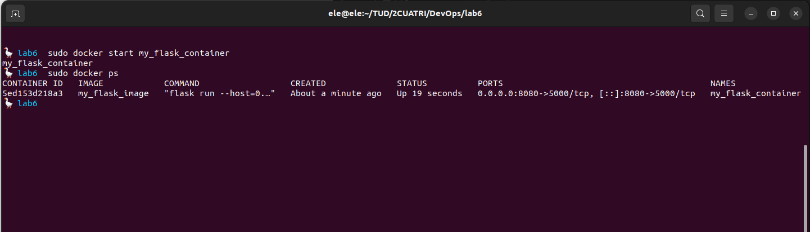
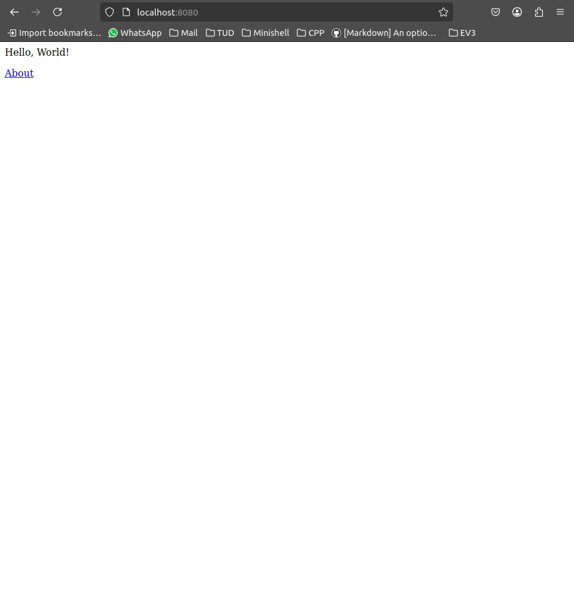

# Lab 6 - Docker and containers

The aim of this lab is to look at how Docker works internally. We will do this in two parts: first we'll have a look at how Docker files works, and how they can be used to build images and containers. Then we'll have a look at a real, production-grade Dockerfile.

## Containerising an application

The process of taking an existing application and putting into a container (this could be a Docker container or otherwise) is called *containerising*. The task for this part of the lab is to make a Dockerfile that will serve a web app. We will be using the Flask app from week 3.

Write a Dockerfile which will run the application in a container.
- There is a [Python Docker container](https://hub.docker.com/_/python), so you can derive your container from it.

- The Python Docker container already has pip installed, so installing the dependencies (Flask) should be easy.

- Recall from lab 3 that Flask serves on port 5000 by default, so we'll have to expose that port in the Dockerfile.

Once you've created the file, you should be able to build the container using the `docker build` command:

~~~bash
docker build -t my_flask_image .
~~~

>[!NOTE]
> The dot indicates that the Dockerfile can be found in the current directory. If you run Docker fom a different directory, you'll have to specify this directory instead of the dot. 
>
> The `-t` means we are giving the container image a tag (human-readable name).

Finally, we can run the image with the command:
~~~bash
docker run -p 8080:5000 --name my_flask_container my_flask_image
~~~

>[!NOTE]
> Here, we're mapping port 5000 of the container to port 8080 on the host machine (port forwarding from the container to the host). We call the running container `my_flask_container`, and we specify that the image we want to run is `my_flask_image`.

If your Dockerfile was correct, you should be able to visit `localhost:8080` on your browser and see the Flask app running at this point.

## Inspecting an existing container

If you containerised the Flask app, you likely derived you container from the `python:3.13` (or equivalently `python:latest`) image. The Dockerfile for this container is [here](https://github.com/docker-library/python/blob/37a6827e0b7a9ef099cfdec5de305e3d4cea7331/3.13/bookworm/Dockerfile). Have a look at it, and answer the following questions:

- The image is itself derived from `buildpack-deps:bookworm`. What is this derived from? Can you trace and list all of the layers used in the container?

- Given that the container image is based on Debian, why do you think the Dockerfile is downloading the source code on line 28 of the Dockerfile? Why not just install the Debian package with `apt`?

- Docker will build the Python interpreter when it builds the image. Python is built using `make`. Can you see the `make` invocation(s) in the Dockerfile? What line(s) does it appear on?

[Answers](questions.pdf)