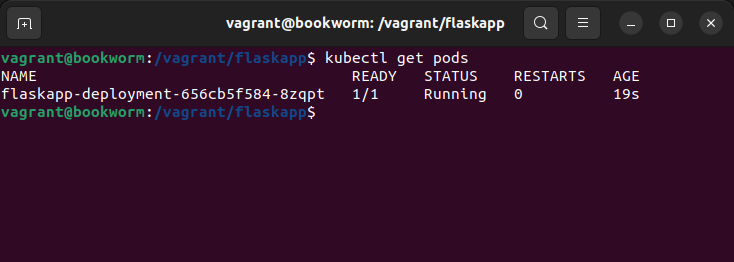
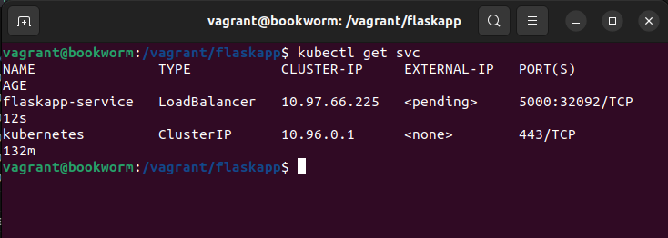
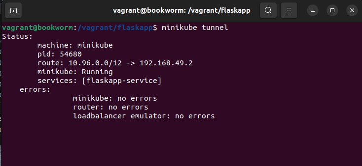
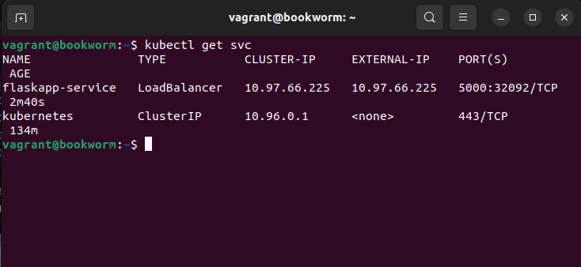
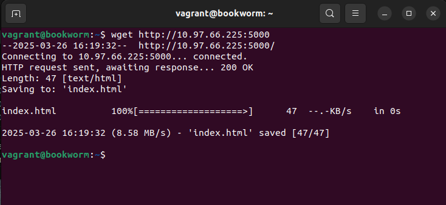
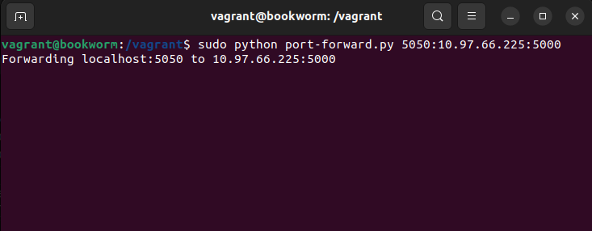
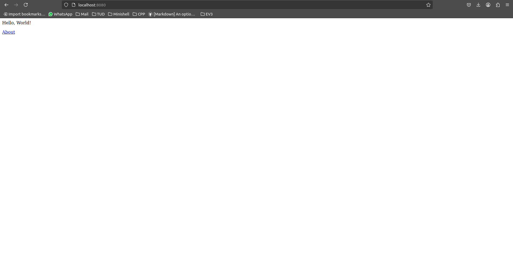

# Lab 7 - Kubernetes

The aim of this lab is to create a simple Kubernetes cluster, which we will use to run the same Flask app we have been using for a number of weeks. We will do this using *Minikube*, which is a piece of software that allows you to run a small Kubernetes cluster inside a Docker container.

In order to work on this lab, you will need a computer with the following programmes installed:
- [Docker](https://docs.docker.com/engine/install/)
- [Minikube](https://minikube.sigs.k8s.io/docs/start/?arch=%2Flinux%2Fx86-64%2Fstable%2Fbinary+download)
- [Kubectl](https://kubernetes.io/docs/tasks/tools/)

To make the setup process easier, there is a Vagrantfile which will set up a VM with these three programmes installed automatically. You'll need to do an extra bit of port forwarding to allow you to access the cluster from your host machine, so there is a Python programme ([port-forwarding.py](port-forwarding.py)) to help with this. The code is a modified version of [this programme](https://github.com/vinodpandey/python-port-forward).

> [!NOTE]
> You can move this file onto your VM using the **/vagrant** directory.

Once everything is installed, you should be able to start a Kubernetes cluster with Minikube by running the command:

~~~ bash
minikube start
~~~

This will take a few minutes to run, but you should have a working cluster when it is finished. The next step is to tell your Docker client to use the Docker daemon in the cluster, rather than the local daemon:

~~~ bash
eval $(minikube -p minikube docker-env)
~~~

## Re-creating the Flask app
As in previous weeks, the emphasis on this lab should be on the DevOsp-related technology we are studying, in the case Kubernetes, not on the application being hosted.

> [!NOTE]
> You will need to have the flask app Python file and the Docker file from previous lab on the VM.

> [!NOTE]
> The container you made in that lab would have run on your local Docker setup. You will need to run the build process (`docker build -t my_flask_image .`) again to ensure it builds inside the Minikube cluster.

## Deploying the container image in a pod
Assuming the build process goes well, it should now be possible to deploy the container inside a Kubernetes Pod using a *deployment*. We create Kubernetes objects by writing a YAML file describing the object we want, and then sending it to the control plane of the cluster using *Kubectl*. Create a YAML file called *flaskapp.yaml* and enter the following into it:

~~~ yaml
apiVersion: apps/v1
kind: Deployment
metadata: 
  name: flaskapp-deployment
spec: 
  selector:
    matchLabels:
      app: flaskapp
  template:
    metadata:
      labels:
        app: flaskapp
    spec:
      containers:
        - name: flaskapp-container
          image: my_flask_image
          imagePullPolicy: Never
~~~

Now, tell the Kubernetes cluster to set up the deployment for us:

~~~ bash
kubectl create -f flaskapp.yaml
~~~

At this point, you should be able to run the command `kubectl get pods` to see the Pod running in the background.

## Accessing the Pod
Remember that Kubernetes Pods can only network with each other by default. To allow our Pod to connect to the VM or host, we need to introduce a *Service*. The most useful type of service is a *Load Balancer*, which sets up a load balancer on the system (it is absolutely overkill for our simple Flask app but we'll use it anyway).

Create a YAML file called *service.yaml*, and enter the following into it:

~~~ yaml
apiVersion: v1
kind: Service
metadata: 
  name: flaskapp-service
spec: 
  ports:
    - port: 5000
      targetPort: 5000
  selector:
    app: flaskapp
  type: LoadBalancer
~~~

> [!NOTE]
> This forward port 5000 from the flaskapp pod to port 5000 outside the cluster.

Start the service by running:

~~~ bash
kubectl create -f service.yaml
~~~

If you run `kubectl get svc`, you should now see the service has deployed. However, the `EXTERNAL-IP` column (which should show the IP address of the cluster for external access) should say that assigning the IP is still pending no matter how long you leave it running.

To get around this, we have to ask Minikube to set up a *tunnel* (a small network that will be set up between the VM and the Kubernetes cluster running on *Minikube*) to allow us to access the cluster. The command for this is: 

~~~ bash
minikube tunnel
~~~

This could take up to several minutes to work. It may also ask you for your password as it runs, since getting up tunnels generally needs root access. This will hang your terminal, but you should be able to access another terminal session to run `kubectl get svc` again. This time, you should see an IP address you can use to access the cluster. 

You should now be able to access the Flask app running on the Pod. Use *wget* to download the web page:

> [!NOTE]
> `IP address` should be substituted with the `EXTERNAL-IP` displayed.

~~~ bash
wget IP address:5000
~~~

If you are running *Minikube* locally, you should be able to type `IP address:5000` into your browser and see the page being served from inside the cluster.

However, if you are running *Minikube* in a VM, the cluster IP will not be accessible, as it can only be accessed from inside the cluster. The Vagrantfile forwards port 5050 in the guest to port 8080 on the host. Thus we need to have some wat of forwarding connections from port 5050 to `IP address:5000`. The included [Python file](port-forward.py) can do this for you. Run the command `sudo python port-forward.py 5050:IP address:5000` to start the forwarding. You should now be able to access `localhost:8080` from your host machine.

> [!NOTE]
> This is quite a complex setup: the HTTP request from your browser arrives in port 8080 of your host machine, is forwarded to port 5050 of the guest machine, then to the service running in the cluster, and finally to the container inside the pod.

