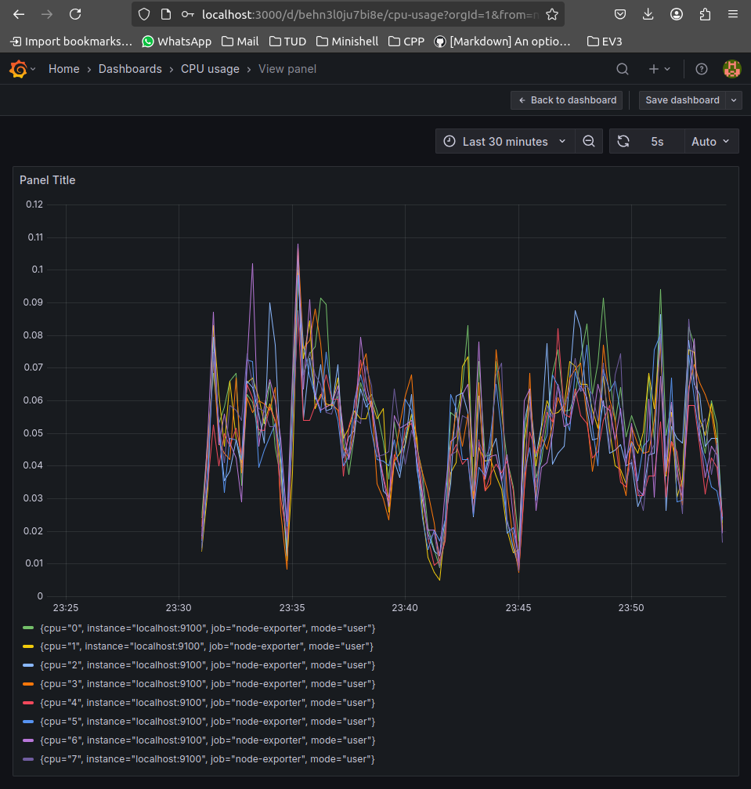

# Lab 8 - Grafana and Prometheus
The aim of this lab is to set up a Grafana and Prometheus instance on your machine to monitor your CPU usage in real-time. Making the same setup run on an Azure Vm or some other remote system would be fairly simple, so this gives you an idea of how monitoring could be set up in a production environment (with the caveat that we're not going to pay attention to security in this lab at all - the [Grafana docs](https://grafana.com/docs/grafana/latest/setup-grafana/set-up-https/) include information on setting up HTTPS if you are interested).

The basic structure of the setup we're going to create is depicted in the diagram below:

The setup consists of:
- A piece of software called an *exporter*, which runs on your local machine and collects information about your machine's statistics (CPU usage, memory usage, etc).

- A *Prometheus* server, which stores the information collected by the exporter so that Grafana can read information that was generated even when Grafana wasn't running.

- *Grafana* itself, which queries Prometheus to access the information requested by the user, and displays it to the user.

We will install each of these applications in turn.

## Installing an exporter
The exporter application you install will depend on the operating system you are using: Unix systems (Linux, macOS or BSDs) should use the [node exporter](https://github.com/prometheus/node_exporter) (see Releases on the right-hand side of the page to download pre-built binaries if you're on Linux or a BSD. Mac users should install the package via [Homebrew](https://formulae.brew.sh/formula/node_exporter#default)), while Windows users should use the [Windows exporter](https://github.com/prometheus-community/windows_exporter). Download and install it on your machine, and run it. It should start serving on port 9100 for Unix machines and port 9182 on Windows. If you visit `http://localhost_9100/metrics` on your browser, you should see plain text returned containing the information being gathered. When you get that working, you can move to the next step.

## Running Prometheus
The next step is to run *Prometheus*. Before we can do this, we have to create a configuration file telling Prometheus that the exporter is running on port 9100. This is done using a YAML file. Create a new file called *prometheus.yaml* and enter the following into it:

~~~ yaml
global:
  scrape_interval: 10s

scrape_configs:
  - job_name: node-exporter
    static_configs:
      - targets: ['host.docker.internal:9100']
~~~

The **host.docker.internal** domain will resolve to your local machine (i.e. to localhost), so that Prometheus can see the exporter running on your host machine. Now we can run Prometheus itself. The easiest way to do this is probably to use Docker, since Prometheus has a well-maintained Docker image. The command to run is:

~~~ bash
docker run -d -p 9090:9090 --name=prometheus -v <YAML file>:/etc/prometheus/prometheus.yaml prom/prometheus:latest
~~~

> [!NOTE]
> Replace \<YAML file\> with the full path to the prometheus.yaml file you created above.

> [!NOTE]
> This command is using a number of Docker options that you may not be familiar with.
>
> -d tells Docker to run the container in the background (i.e. don't hang).
>
> -v mounts the *prometheus.yaml* file into **/etc/prometheus/prometheus.yaml** in the container, which is where the Prometheus server itself expects to find the file.

The Prometheus server runs on port 9090, so you should be able to access `localhost:9090` on your browser when it is running. This will show a simple UI that you can use. 

Firstly verify that Prometheus can see your exporter: click *Status > Targets* and verify that the exporter on port 9100 is visible and the state shown is **UP**. 

Prometheus has a querying language called *PromQL*. You can type PromQL queries into the text box on the page, and click evaluate to see the results. For example, on a Linux or Mac machine, you can see the network traffic statistics over the last minute with the query:

~~~
rate(node_network_receive_bytes_total[1m])
~~~

These queries will show one column of output per network interface on your machine. Once you have this working, you can move on to installing Grafana.

## Installing Grafana
Again, we install Grafana using Docker:

~~~bash
docker run -d -p 3000:3000 --name=grafana grafana/grafana-oss:latest
~~~

Grafana runs on port 3000, so you should be able to access at `localhost:3000` in your browser. The default username and password are both `admin`, and you will be asked to change the password when you first log in. You can create a new user account by clicking *Menu > Administration > Users > New user*, although using the default `admin` account should be fine for the purposes of this lab.

Before we can do anything, we have to tell Grafana about our Prometheus server. Click *Menu > Connections > Data sources > Add data source > Prometheus*. In the *Prometheus server URL* field, enter the URL of your Prometheus server (`http://IP address:9090` replacing `IP address` with the IP address of the Prometheus container,which you can find by typing `docker inspect prometheus`), then click *Save & test*. Grafana should give feedback telling you it can access Prometheus.

To create a graph depicting the CPU usage, click *Menu > Dashboards > Create Dashboard > Add visualization*. Click *Prometheus* as your data source, and you will be shown a screen with an example graph visible at the top of the screen, and a PromQL query editor at the bottom of the screen. The query editor provides a query builder wizard with drop-down boxes by default, but if you click Code (at the top right-hand side of the query editor view) you will be able to type PromQL code directly. The PromQL query to get CPU usage on a Unix system is:

~~~
rate(node_cpu_seconds_total{mode="user"}[30s])
~~~

Enter the query and then click *Run queries*. Change the timescale (at the top right of the graph) to show the last 30 minutes only. Then save the visualization by clicking Save at the top right of the page, and giving your graph a name (e.g. CPU usage). When you do this, you'll be brought to a homepage for your dashboard, showing the visualization (note that a dashboard can show multiple visualizations at a time, although we are not using this feature). If you mouse over the graph and press the letter **v** on your keyboard, you will see a full-screen view of your graph. On the top right of the page is a refresh button you can use to update the graph. There is a drop-down next to it that you can use to enable auto-refresh, which lets you see the graph updating in real-time. If you try running a CPU intensive workload during that time you should see a spike in the CPU usage.

